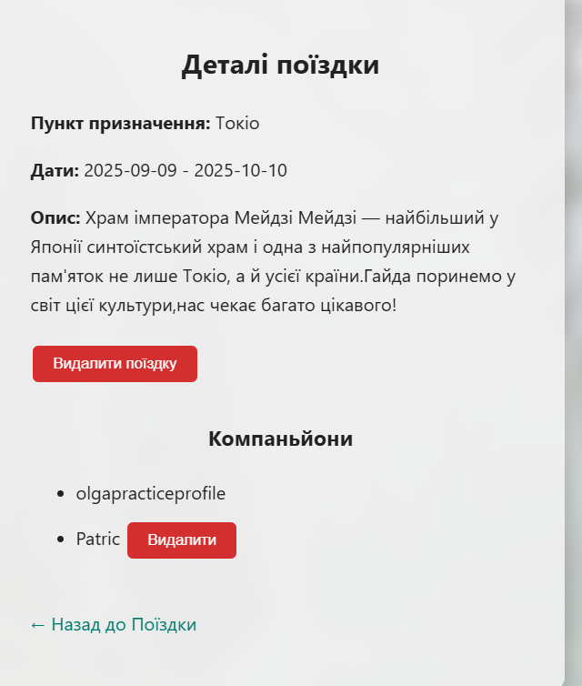
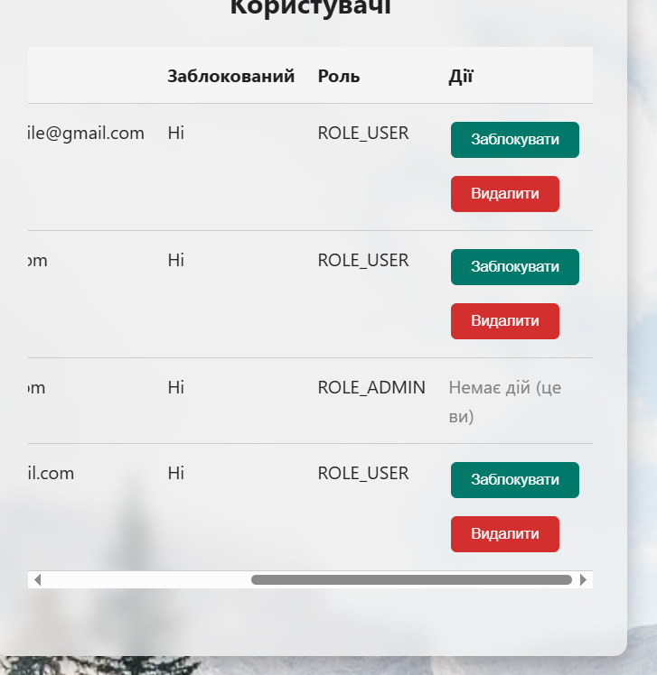
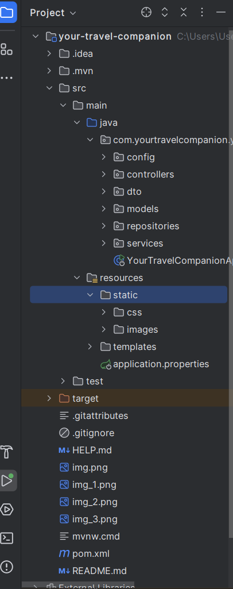

Дипломний проект з курсу по Java.

"Your Travel Companion"-це веб застосунок,створений для пошуку компаньйона,для спільних подорожей.

**В цьому проекті є такі функції як:
*Вхід та реєстрація користувачів через Email або Google(коли реєстрація буде через email(має бути реальний),
то на пошту прийде повідомлення з кодом для верифікації(шукати в папці "Спам");
*В профілі є можливість редагувати (адресу та номер телефону);
*Можна створити поїздку,переглянути,знайти(пошук),приєднатися або вийти з поїздки;
 Автор поїздки має такі можливості як:
-Видалити користувача який приєднався та видалити ту поїздку яку створив сам (;
*Що стосується Адміна ,він має такі самі можливості як і звичайний користувач але додатково він має "Адмін панель" з
можливістю :
-заблокувати/розблокувати користувача;
-видалити користувача/поїздку;
-себе заблокувати або видалити він не може 

**Структура проекту 

**Технології які тут використані:
- Java 21
- Spring Boot 3 (MVC, Security, Data JPA)
- MySQL 8
- Thymeleaf
- OAuth2 (авторизація через Google)
- HTML/CSS (без сторонніх фреймворків)
- Maven
 