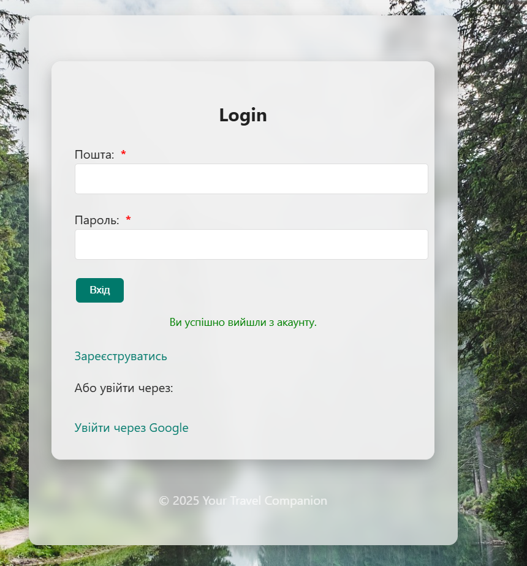

                                        Дипломний проект з курсу по Java.

"Your Travel Companion"-це веб застосунок,створений для пошуку компаньйона,для спільних подорожей.В ньому можно знайти
або створити(видалити) поїздку,приєднатись(вийти) до них,також є можливість редагувати профіль(телефон/адрес).
Є роль адміна з можливістю модерації.

Ролі користувачів та їх можливості
                                    Звичайний користувач:
-Реєстрація через email або Google; 
-Підтвердження email через код (перевірити папку "Спам");
-Редагування профілю (адреса, телефон);
-Створення, перегляд, пошук та видалення поїздок(видалити поїздку може тільки її автор або адмін);
-Приєднання до поїздки або вихід із неї;
-Якщо Ви є автором поїздки то Ви маєте можливість видалити компаньйона.
Тестовий користувач:(підтягнеться якщо додати dump.sql)
Пошта:test@example.com
Пароль:password
                                        Адміністратор:
-Має всі права звичайного користувача та додатково має:
                                    Адмін-панель з можливістю:

-Заблокувати/розблокувати користувача;
-Видалити користувача або поїздку;
-Неможливо видалити або заблокувати самого себе;
Тестовий адмін:
Пошта:admin@gmail.com
Пароль:admin

Структура БД:
-users — користувачі
-trips — поїздки
-companions — заявки на поїздки
-countries — список країн(додавався вручну через БД, доступні приклади в дампі)

Технології які тут використані:
- Java 21
- Spring Boot 3 (MVC, Security, Data JPA)
- MySQL 8
- Thymeleaf
- OAuth2 (авторизація через Google)
- HTML/CSS (без сторонніх фреймворків)
- Maven

Повідомлення системи:
Інформативні повідомлення:
-При невірному логіні або паролі;
-При спробі входу заблокованим користувачем — повідомлення "Ваш профіль заблоковано.";
-При успішному виході з акаунту;
-При невірному коді(підтвердження пошти);

                                  Як запустити локально:
- Клонувати репозиторій  (git clone https://github.com/TOlgaG13/your-travel-companion);
- Імпортувати дамп БД (mysql -u root -p travelcompanion < travelcompanion_dump.sql);
- Вставити свої дані у application.properties;
- Запустити додаток;
- Відкрити у браузері.

P.S.
У процесі розробки виникали труднощі з фронтендом та його взаємодією с бекендом.
Також складнощі були з коректним налаштуванням SecurityConfig.
В майбутньму ще треба буде зробити рефакторінг проекту.
Але загалом що хотіла зробити,все зробила та картинка мені подобається:)

У майбутньому хочу додати:
-завантаження аватара;
-розширене редагування профілю;
-чат між попутниками(або якийсь загальний між користувачами);
-можливість написання відгуків,рейтінг поїздок або користувачів.
 